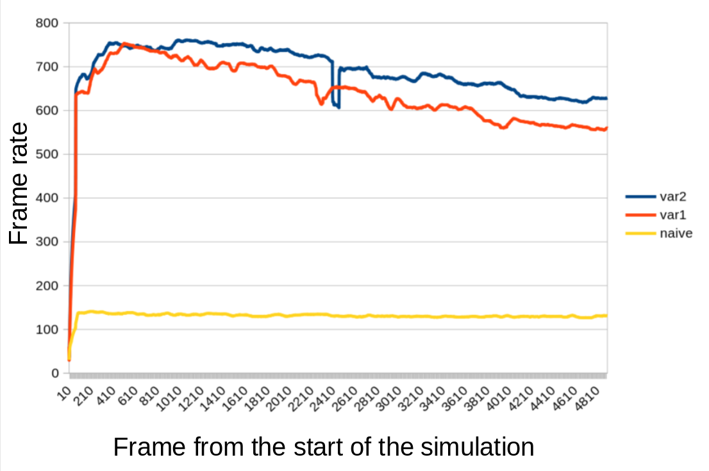

# Boids Simulation with CUDA

|  |  |
|---|---|
|||

This application is an implementation of a 3D [boids](https://en.wikipedia.org/wiki/Boids) simulation. Each boid is represented by a wireframe of a tetrahedron and is enclosed in an aquarium. User can add box obstacles and adjust the following parameters in real time:
- Separation: steer to avoid crowding local flockmates,
    Alignment: steer towards the average heading of local flockmates,
- Cohesion: steer to move towards the average position (center of mass) of local flockmates,
- View radius: determines the radius of a sphere containing all visible boids by every boid,
- Noise: determines the amount of random acceleration applied each frame,
- Minimum speed,
- Maximum speed.

User can reset the simulation with different aquarium size, boids count and choose one of the following algorithms:
1. CPU naive algorithm,
2. GPU naive algorithm,
3. grid based GPU algorithm in the 1st variant,
4. grid based GPU algorithm in the 2nd variant.

Both `3` and `4` algorithms are based on a grid approach with sorting, which is described [here](https://developer.download.nvidia.com/assets/cuda/files/particles.pdf) (page 6).

The difference is that algorithm `3` capitalizes on the fact that many boids within a singular thread block, are within the same grid cell. To speed up the boid acceleration update process for these boids sharing a cell, shared memory is used. Conversely, Algorithm `4` overlooks this observation.

All 3 GPU methods speeds are compared on the following graph:

The conclusion drawn from the above graph is that the theoretical observation used for algorithm `3` is slowing the algorithm down.

## Usage
1. Use `W`, `S`, `A`, `D` to rotate the camera and `Q`, `E` to zoom in/out.
2. Use `Simulation` window to
    - restart the simulation with different aquarium size, boids count and algorithm,
    - modify the simulation parameters in real time,
    - add box obstacles.

## Requirements
You need [NVIDIA CUDA GPU](https://developer.nvidia.com/cuda-gpus) to run the application. This application has been tested on the following GPU's: 
| GPU | Memory | Compute Capability |
|---|---|---|
| NVIDIA GTX 1650Ti  | 4GB | 7.5 |
| NVIDIA GTX 1060  | 3GB | 6.1 |
| NVIDIA GTX 1070  | 8GB | 6.1 |
| NVIDIA RTX 3070  | 8GB | 8.6 |

## Compilation Guide
In order to compile the project you need to download and install [NVIDIA CUDA Toolkit](https://developer.nvidia.com/cuda-downloads) and [CMake](https://cmake.org/) first.

### Linux
1. Clone the repository to the desired location `git clone https://github.com/migoox/boids-simulation`,
2. Navigate to the cloned directory and run `cmake .`,
3. Run `make`.
### Windows
1. Clone the repository to the desired location `git clone https://github.com/migoox/boids-simulation`,
2. Navigate to the cloned directory and run `cmake .`,
3. Open `boids_simulation.sln` using Visual Studio,
4. Set `boids_simulation` as the Startup Project (right click on `boids_simulation` and choose `Set as Startup Project`),
5. Compile using Debug/Release mode.
